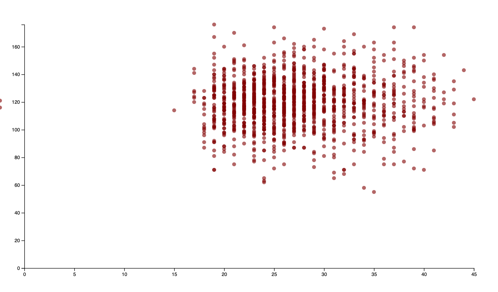

## NOTES

-----------
INSTRUCTIONS:
Use this markdown file to keep track of open questions/challenges from this week's assignment.
- What did you have trouble solving?
- What went easier than expected?
- What, if anything, is currently blocking you?

Noting the differences between having to map over a value to set a domain, 
and plotting numerical data for both axes. Honestly, it took me an hour to debug
compare commit `50b47c31b896864f897716a6a73365b86f12d323` to 
`429173933b75babb90efb12ddc01da5ab6e8c880`. Not coming as naturally as I wanted
it to.

So, after a bit of tweaks, I ended up with a graph looking if birth weight
correlated with the age of the mother:



At this point, is occuring to me that having the minimum domain of the x-axis
be zero is kind not helping. Also, I wanted to extend the y-axis a bit to
reference the max weight

``` const xScale = d3.scaleLinear()
      .domain([10, d3.max(data, d => d.age)])
      .range([margin, width - margin])

    const yScale = d3.scaleLinear()
      .domain([0, (d3.max(data, d => d.bwt) + 10)])
      .range([height - margin, margin])
```

If you find you're not able complete this week's assignment, reflecting on where you are getting stuck here will help you get full credit for this week's tutorial

------------
